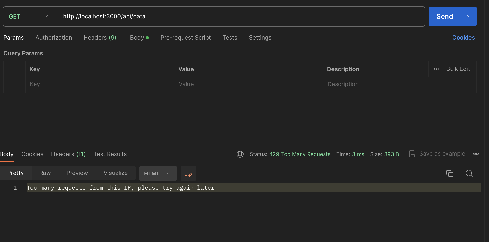

# Rate Limiter for Express.js

A rate limiting middleware for Express.js applications.

## Installation

```bash
npm install express express-rate-limit
```

## Example
To test the rate limiter, send multiple GET requests to the /api/data route within a minute using tools like Postman.


